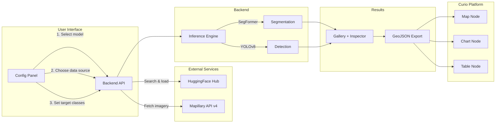

# Street-Level Vision Analytics Node for Curio

A configurable computer vision node for [Curio](https://github.com/urban-toolkit/curio), an urban visual analytics platform. This node enables urban planners and city analysts to apply pre-trained deep learning models — semantic segmentation, object detection, and image classification — to street-level imagery from sources like Mapillary, all through an interactive interface without writing code. Results flow as GeoJSON into Curio's dataflow graph for downstream map, chart, and table visualization.

**CS 524: Big Data Visual Analytics — Spring 2026 — Group 13**

**Team:** L. Sravya Rachakonda & Laxmi Sai Maneesh Reddy Jupalle

---

## Features

- **Model selection** — Browse and search HuggingFace models by task type (segmentation, detection) with live search and download counts
- **Flexible data sources** — Real Mapillary street-level imagery, local folders, or bundled sample images (20 images from NYC, Chicago, SF, Paris, London)
- **Real CV inference** — Actual SegFormer semantic segmentation on CPU with per-pixel class predictions and colored overlay generation
- **Configurable target classes** — Select classes via suggestion chips (Cityscapes preset) or type custom classes, with CSV upload support
- **Results gallery** — Interactive image grid with color-coded metric badges (green/amber/red based on class ratios)
- **Image inspector** — Source photo, CV overlay (composited from real segmentation mask), side-by-side comparison, and per-class breakdown bar chart
- **Consistent color system** — Shared palette across overlays, charts, and chips (road=blue, building=green, vegetation=amber, sky=light blue, sidewalk=pink)
- **Compound filtering** — Filter results by any class attribute with configurable operators (e.g., "vegetation > 30%")
- **Error flagging** — Flag incorrect CV outputs for exclusion from aggregation
- **Curio integration** — Registered as a proper Curio node (BoxDescriptor + lifecycle hook), appears in the node palette, outputs GeoJSON through Curio's dataflow graph
- **GeoJSON export** — Results available as standard GeoJSON FeatureCollection for downstream map/chart/table nodes
- **Demo mode** — Works without API keys using simulated data when Mapillary token is not configured

---

## Architecture



### Data Flow

1. **Configure** — User selects a CV model from HuggingFace, a data source (Mapillary / local folder / samples), and target classes
2. **Fetch** — Backend retrieves street-level images from the chosen source
3. **Infer** — Images are processed through the selected model (SegFormer or YOLOv8) on the backend
4. **Explore** — Results appear in an interactive gallery with overlays, class breakdowns, and filtering
5. **Export** — Results are exported as a GeoJSON FeatureCollection for Curio's downstream nodes

---

## Tech Stack

| Layer | Technology |
|-------|-----------|
| Backend | Python, FastAPI, Uvicorn |
| CV Models | HuggingFace Transformers (SegFormer), Ultralytics YOLOv8 |
| Street Imagery | Mapillary API v4 |
| Frontend | React 18, TypeScript, Vite, Tailwind CSS |
| Curio Integration | React Flow v11, custom BoxDescriptor + lifecycle hook |
| Spatial Processing | GeoPandas, Shapely |
| Data Formats | GeoJSON, JSON, CSV |

---

## Setup

### Prerequisites

- Python 3.10+
- Node.js 18+
- (Optional) [Mapillary API token](https://www.mapillary.com/developer) — enables real street-level imagery
- (Optional) HuggingFace token — only needed for private models

### Backend

```bash
cd Street-Level-Vision-Analytics-Node-for-Curio

# Create and activate virtual environment
python -m venv .venv
source .venv/bin/activate        # macOS/Linux
# .venv\Scripts\activate         # Windows

# Install dependencies
pip install -r requirements.txt

# Configure environment
cp .env.example .env
# Edit .env to add your API tokens (optional)

# Start the server
uvicorn backend.main:app --reload --port 8000
```

API docs are available at `http://127.0.0.1:8000/docs`.

### Frontend

```bash
cd frontend
npm install
npm run dev
```

Open `http://localhost:5173` in your browser.

### Running with Curio (all 3 servers)

```bash
# Terminal 1 — Curio Flask backend (port 5002)
cd curio && python -c "from utk_curio.backend.app import create_app; app=create_app(); app.run(host='localhost', port=5002)"

# Terminal 2 — Street Vision backend (port 8000)
uvicorn backend.main:app --reload --port 8000

# Terminal 3 — Street Vision frontend (port 5173)
cd frontend && npm run dev

# Terminal 4 — Curio frontend (port 3000)
cd curio/utk_curio/frontend/urban-workflows && npx webpack serve --mode development --port 3000
```

Then open `http://localhost:3000`, drag "Street Vision" from the node palette, and start analyzing.

> For detailed installation instructions, see [docs/setup.md](docs/setup.md).

---

## Project Structure

```
Street-Level-Vision-Analytics-Node-for-Curio/
├── backend/                  # FastAPI server + CV inference pipeline
│   ├── main.py               #   App entry point, CORS middleware
│   ├── config.py             #   Environment settings (pydantic-settings)
│   ├── routers/              #   API endpoint modules (health, models, data, inference)
│   ├── services/             #   Business logic (HuggingFace, Mapillary, inference, spatial, cache)
│   ├── models/               #   Pydantic request/response schemas
│   └── utils/                #   Image processing and geo helpers
├── frontend/                 # React + TypeScript standalone UI (Vite)
│   └── src/
│       ├── components/       #     ConfigPanel (sidebar), Gallery (results), common UI
│       ├── hooks/            #     useModels, useInference, useDataSource, useFilters
│       ├── services/         #     Axios API client
│       ├── constants/        #     Shared class color palette
│       └── types/            #     TypeScript interfaces
├── curio-integration/        # Files for Curio node registration
│   └── streetVisionLifecycle.tsx  # Node lifecycle hook
├── data/                     # Sample data and class definitions
│   ├── sample_images/        #   20 real Mapillary street-level images
│   ├── chicago_bbox.json     #   Chicago Lincoln Park bounding box
│   └── class_definitions/    #   Cityscapes 19-class CSV, street furniture CSV
├── scripts/                  # Utility scripts
│   └── download_samples.py   #   Download sample Mapillary images
├── evaluation/               # Case studies and task inventory
└── docs/                     # Documentation
    ├── setup.md              #   Detailed installation guide
    ├── architecture.md       #   System design documentation
    └── api_reference.md      #   Backend API endpoint reference
```

---

## Dataset Access

### Mapillary API Token

This project uses [Mapillary](https://www.mapillary.com/) for street-level imagery. To enable real image fetching:

1. Create a free account at [mapillary.com](https://www.mapillary.com/)
2. Go to [Developer settings](https://www.mapillary.com/developer)
3. Create a new application to get a **Client Token**
4. Add it to your `.env` file:
   ```
   MAPILLARY_ACCESS_TOKEN=MLY|your_token_here
   ```

Without a token, the app runs in **demo mode** with simulated data — fully functional for exploring the interface and testing the workflow.

### Sample Images

To download 20 pre-selected street-level images (NYC, Chicago, SF, Paris, London):

```bash
python scripts/download_samples.py
```

Images are saved to `data/sample_images/` and can be used as a data source without any API token.

---

## Quick Demo

1. Start backend (`uvicorn backend.main:app --reload --port 8000`) and frontend (`cd frontend && npm run dev`)
2. Open `http://localhost:5173`
3. **Step 1** — Search `cityscapes`, select `segformer-b2-finetuned-cityscapes-1024-1024`
4. **Step 2** — "Sample Images" is pre-selected (20 real Mapillary street photos)
5. **Step 3** — Click chips: `vegetation`, `road`, `building`, `sidewalk`, `sky`
6. Click **Run Analysis** — real SegFormer inference runs (~30s for 20 images on CPU)
7. Browse the gallery, click any card to open the inspector with real segmentation overlays
8. In Curio: drag "Street Vision" node → click "Configure & Run" → run analysis → click "Fetch Results as GeoJSON" → data flows downstream

---

## Case Studies

### Chicago Greenery Assessment
- **Model:** SegFormer (semantic segmentation, `nvidia/segformer-b2-finetuned-cityscapes-1024-1024`)
- **Data:** Mapillary API / sample images from urban neighborhoods
- **Classes:** vegetation, sidewalk, road, building, sky
- **Output:** Per-image greenery percentage, per-class breakdown, spatial aggregation

### Vehicle Counting
- **Model:** YOLOv8 (object detection)
- **Data:** Local camera folder or Mapillary
- **Classes:** car, truck, motorcycle, bicycle
- **Output:** Object counts per image, bounding box visualization

---

## Evaluation

Our evaluation focuses on **what new analytical tasks the node enables**, not CV model accuracy:

1. **Task inventory** — 7 specific analytical tasks newly enabled by the node (see `evaluation/task_inventory.md`)
2. **Case study walkthrough** — End-to-end Chicago greenery analysis with real SegFormer
3. **Configuration generality** — Same node reconfigured for vehicle counting (model swap, no code changes)
4. **Performance benchmarks** — Latency measurements at different image counts (see `evaluation/performance_benchmarks/`)

---

## Screenshots

> Screenshots will be added after the final UI is complete.

| View | Description |
|------|-------------|
|  | Model selection, data source, and class configuration sidebar |
|  | Results gallery with color-coded metric badges |
|  | Full-size overlay inspection with class breakdown chart |
|  | Street Vision node inside the Curio dataflow canvas |

---

## API Reference

See [docs/api_reference.md](docs/api_reference.md) for complete endpoint documentation with request/response examples.

| Endpoint | Method | Description |
|----------|--------|-------------|
| `/api/health` | GET | Health check and demo mode status |
| `/api/models/search` | GET | Search HuggingFace models by task |
| `/api/models/{id}/info` | GET | Get model metadata |
| `/api/models/load` | POST | Load model into memory |
| `/api/data/mapillary/fetch` | POST | Fetch images in bounding box |
| `/api/data/mapillary/coverage` | POST | Check image count in area |
| `/api/data/folder/load` | POST | Load images from local folder |
| `/api/data/sample/list` | GET | List bundled sample images |
| `/api/inference/run` | POST | Start async inference job |
| `/api/inference/status/{id}` | GET | Poll job progress |
| `/api/inference/results/{id}` | GET | Get job results |
| `/api/inference/results/{id}/geojson` | GET | Export results as GeoJSON |

---

## License

This project is developed for academic purposes as part of CS 524 at the University of Illinois Chicago.
