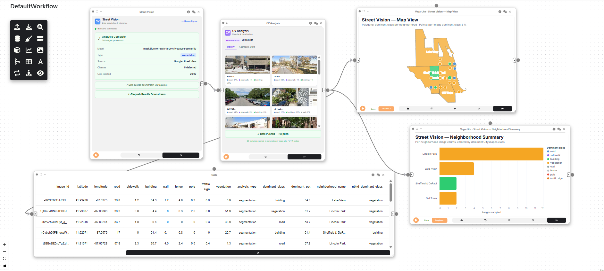
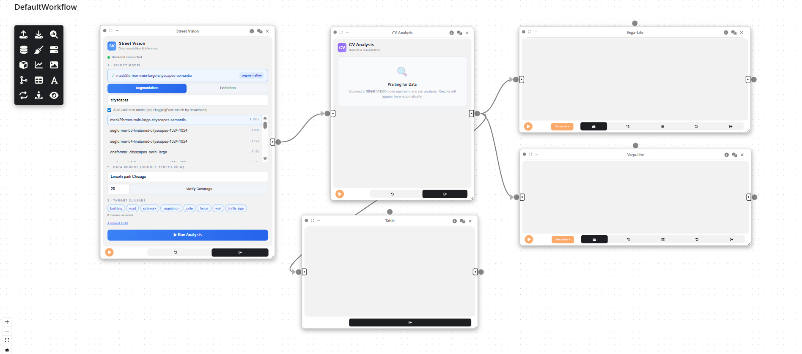
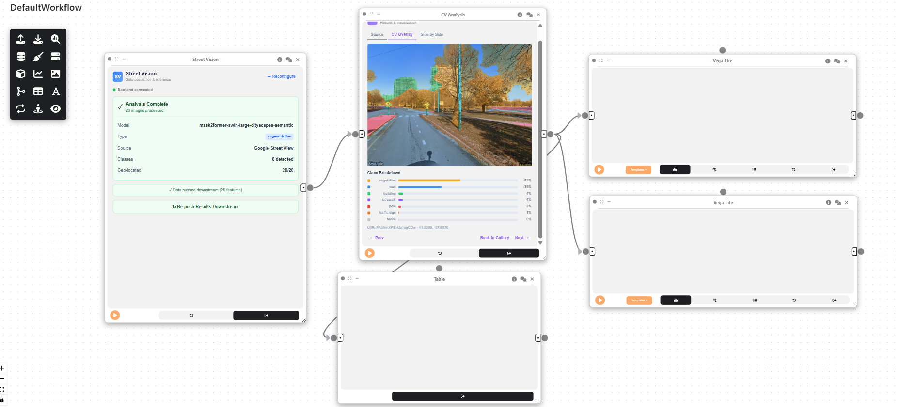
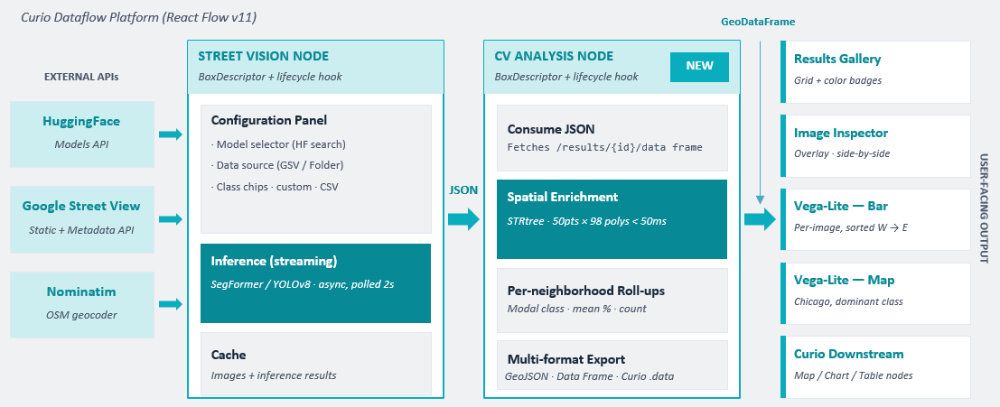

# Street-Level Vision Analytics Node for Curio

> A two-node extension to [Curio](https://github.com/urban-toolkit/curio) that brings pre-trained
> computer vision into a no-code urban dataflow workflow. Pick a HuggingFace segmentation or
> detection model, type a Chicago place name, and route the per-image and per-neighborhood
> outputs into Curio's existing Vega-Lite, Map, and Table nodes — all without writing Python.

**CS 524: Big Data Visual Analytics — Spring 2026 — Group 13**
**Authors:** L. Sravya Rachakonda · Laxmi Sai Maneesh Reddy Jupalle
**University of Illinois Chicago**

<p align="center">
  
</p>

---

## Table of Contents

1. [Problem Statement](#problem-statement)
2. [Demo](#demo)
3. [Key Features](#key-features)
4. [System Architecture](#system-architecture)
5. [Project Structure](#project-structure)
6. [Setup](#setup)
7. [Dataset Access](#dataset-access)
8. [How to Run](#how-to-run)
9. [Reproducing Key Results](#reproducing-key-results)
10. [Results Artifacts](#results-artifacts)
11. [API Reference](#api-reference)
12. [Documentation](#documentation)
13. [Citation & License](#citation--license)

---

## Problem Statement

Cities now publish petabyte-scale street-level imagery (Google Street View, Mapillary, municipal
camera rigs), and a decade of computer-vision research has shown that pre-trained semantic
segmentation and object detection models can extract policy-relevant signals from those images:
tree canopy, sidewalk condition, vehicle composition, accessibility infrastructure. **The
catch is workflow friction.** An urban planner asking *"which Lincoln Park blocks have less
than 10% sidewalk?"* currently has to learn the HuggingFace API, write image-fetching code
against the Street View Static API, manage a CUDA environment, run inference, then stitch the
results into a GIS pipeline alongside census tracts. The CV is the easy part — the plumbing is
what blocks adoption.

This project closes that gap by extending Curio with a **two-node CV pipeline**:

- **Street Vision** — model selection, place-name search, Google Street View sampling, inference.
- **CV Analysis** — gallery / inspector UI, server-side neighborhood enrichment, GeoJSON +
  DataFrame export to downstream Vega-Lite and UTK nodes.

Splitting the work across two nodes (rather than one monolithic widget) was a direct response to
instructor feedback in M2: it forces a clean serialization boundary between inference and
visualization, and the GeoJSON output slots into Curio's existing visualization nodes with no
special-casing.

---

## Demo

### Walkthrough video

A two-minute end-to-end walkthrough — model selection, place search, run, image inspector,
Vega-Lite Map View — runs inline below.


https://github.com/user-attachments/assets/2d75b354-8ef7-4607-acbf-d7bc316a2684


### Screenshots

| Curio canvas (teaser) | Configuration wizard | Image inspector |
| :---: | :---: | :---: |
|  |  |  |
| Street Vision → CV Analysis → Map View + Bar Chart + Table | Three-step wizard inside the Street Vision node | Source photo + Mask2Former overlay + class breakdown |

---

## Key Features

- **HuggingFace model picker** — search by task (segmentation / detection), live download counts,
  auto-pick top result. Tested with SegFormer, Mask2Former, OneFormer, BEiT, DPT, YOLOv8.
- **Place-name search** — Nominatim geocodes a free-text place name to a bounding box; the
  Street View **Metadata API** is used for free coverage probing before any paid image fetch.
- **Real CV inference on CPU** — SegFormer / Mask2Former for semantic segmentation; YOLOv8 for
  detection. Per-image inference is cached so repeat runs amortize the model load cost.
- **Server-side spatial enrichment** — every result is tagged with its Chicago neighborhood via a
  Shapely `STRtree` point-in-polygon join; per-neighborhood roll-ups (modal class, mean
  dominance %, image count) are computed on the backend.
- **Built-in Vega-Lite templates** — a default per-image stacked bar (sorted west→east) and a
  Chicago **Map View** that paints searched neighborhoods by their dominant Cityscapes class,
  labels them by name, and overlays per-image points sized by dominance.
- **Two output formats** — a GeoJSON FeatureCollection on the CV Analysis output port for UTK
  and external consumers, plus a column-oriented DataFrame projection for in-Curio Vega-Lite.
- **Compound filtering** — filter results by any class attribute and operator
  (e.g., `vegetation > 0.30 AND road < 0.20`) directly in the gallery.
- **Local folder fallback** — point the node at any folder of `.jpg/.png/.webp` files for offline
  analysis when no Google Street View key is available.

---

## System Architecture

<p align="center">
  
</p>

A more detailed walkthrough of the three layers (Curio nodes, frontend, backend) lives in
[`docs/architecture.md`](docs/architecture.md).

### Data Flow (one analysis)

1. **Configure** — user picks a HuggingFace model, a place name, and target classes inside the
   Street Vision node's three-step wizard.
2. **Fetch** — backend geocodes the place via Nominatim, samples the resulting bbox against the
   Street View Metadata API, downloads covered panoramas as 640×480 / 90° FoV images.
3. **Infer** — images are batched through the selected model on CPU; segmentation produces a
   colored overlay PNG plus a per-class pixel-ratio dict, detection produces bounding boxes plus
   per-class object counts.
4. **Enrich** — CV Analysis posts the results to `/api/data/basemap/enrich_with_neighborhoods`,
   which runs the STRtree join and returns per-point neighborhood tags + per-neighborhood
   aggregates.
5. **Export** — CV Analysis emits a GeoJSON FeatureCollection (and exposes a DataFrame projection
   over a separate REST endpoint) consumed by downstream Vega-Lite, UTK, Map, and Table nodes.

---

## Project Structure

```
.
├── README.md                 # ← this file
├── requirements.txt          # Pinned-by-convention Python deps (see Setup)
├── pyproject.toml            # pytest config
├── backend/                  # FastAPI server + inference pipeline
│   ├── main.py               #   App entry, CORS, router registration
│   ├── config.py             #   Settings via pydantic-settings (.env)
│   ├── routers/              #   API modules: health, models, data_sources, inference
│   ├── services/             #   HuggingFace, Google Street View, inference, spatial, cache
│   ├── models/               #   Pydantic request/response schemas
│   └── utils/                #   Image and geo helpers
├── frontend/                 # React 19 + TypeScript + Vite UI (also embedded in Curio)
│   └── src/
│       ├── components/       #     ConfigPanel, Gallery, Inspector, common UI
│       ├── hooks/            #     useModels, useInference, useDataSource, useFilters
│       ├── services/         #     Axios API client
│       ├── utils/apiBase.ts  #     Resolves backend URL across Vite + webpack/Curio
│       ├── constants/        #     Shared Cityscapes color palette
│       └── types/            #     TypeScript interfaces
├── curio/                    # Forked Curio with Street Vision + CV Analysis registered
├── curio-integration/        # Files needed to graft those nodes onto a clean Curio clone
│   ├── streetVisionLifecycle.tsx
│   ├── cvAnalysisLifecycle.tsx
│   ├── curio-fork.patch
│   └── README.md             #   Apply instructions
├── data/
│   ├── chicago_bbox.json
│   ├── chicago_neighborhoods.geojson
│   └── class_definitions/    #   Cityscapes 19-class CSV, street furniture, vegetation
├── docs/
│   ├── architecture.md       #   Layer-by-layer walkthrough
│   ├── api_reference.md      #   Full request/response spec for every endpoint
│   └── setup.md              #   Detailed install + troubleshooting
├── evaluation/
│   ├── task_inventory.md     #   Seven analytical tasks the node enables
│   ├── case_studies/
│   │   ├── chicago_greenery/config.json
│   │   └── vehicle_counting/config.json
│   └── performance_benchmarks/
│       ├── README.md
│       ├── benchmark.py
│       └── results.json
├── paper/                    # IEEE VGTC 4-page paper (LaTeX)
│   ├── main.tex
│   ├── template.bib
│   └── figures/              #   Teaser, architecture, wizard, inspector
├── cache/                    # Locally-fetched Street View imagery (gitignored at runtime)
└── model_cache/              # HuggingFace + Ultralytics model weights (gitignored)
```

---

## Setup

### Prerequisites

| Requirement | Version | Notes |
| --- | --- | --- |
| Python | 3.10+ | Backend runtime |
| Node.js | 18+ | Frontend + Curio webpack |
| pip / npm | latest | Package managers |
| Git | any | For cloning + applying the Curio patch |
| **Google Maps API key** | — | Required for live Street View — needs both Static + Metadata APIs enabled |
| HuggingFace token | — | *Optional*, only for private/gated models |

### 1 — Clone

```bash
git clone https://github.com/ManeeshJupalle/Street-Level-Vision-Analytics-Node-for-Curio.git
cd Street-Level-Vision-Analytics-Node-for-Curio
```

### 2 — Backend (Python, FastAPI, port 8000)

```bash
# Create and activate a virtual environment at the repo root
python -m venv .venv
source .venv/bin/activate            # macOS / Linux
# .venv\Scripts\Activate.ps1          # Windows PowerShell

# Install pinned dependencies
pip install -r requirements.txt

# Configure environment
cp .env.example .env                  # then add GOOGLE_MAPS_API_KEY=AIza...
```

> **Pinning policy.** `requirements.txt` is fully pinned (every dependency at the version used
> to produce the results in [`evaluation/`](evaluation/)). To upgrade: bump a version, re-run
> `pytest backend/tests/` and `python -m evaluation.performance_benchmarks.benchmark`, then
> regenerate the file from `pip freeze`.

### 3 — Frontend (React 19, Vite)

```bash
cd frontend
npm install
```

### 4 — Curio integration (only if you don't already have the bundled fork)

If you cloned this repo with the `curio/` directory present, skip this step. Otherwise:

```bash
# Clone Curio next to this repo
git clone https://github.com/urban-toolkit/curio.git

# Apply the lifecycle hooks + descriptor patch
cp curio-integration/streetVisionLifecycle.tsx \
   curio/utk_curio/frontend/urban-workflows/src/adapters/box/
cp curio-integration/cvAnalysisLifecycle.tsx \
   curio/utk_curio/frontend/urban-workflows/src/adapters/box/
cd curio && git apply ../curio-integration/curio-fork.patch
```

Full step-by-step install + troubleshooting: [`docs/setup.md`](docs/setup.md).

---

## Dataset Access

### Google Street View (primary imagery source)

The system fetches images live from the Google Street View Static API. To enable it:

1. Create or select a project in the [Google Cloud Console](https://console.cloud.google.com/).
2. **APIs & Services → Library**, enable both:
   - **Street View Static API**
   - **Street View Metadata API** (used for free coverage probing — does not consume image quota)
3. **APIs & Services → Credentials**, create an API key (and restrict it to the two APIs above).
4. Add it to `.env`:
   ```env
   GOOGLE_MAPS_API_KEY=AIza...your_key_here
   ```
5. Restart the backend. `GET /api/health` should now report `"has_google_api_key": true` and
   `"demo_mode": false`.

> **Why we don't redistribute imagery.** Google Street View imagery is licensed and cannot be
> bundled with the repo. The Metadata API checks coverage for free, so users can sweep large
> areas to plan a run before spending image quota.

### Local-folder fallback (for offline reproducibility)

If you don't have a Google Maps key, point the **Folder** data source at any directory of
local `.jpg / .png / .webp` files. Inference runs identically; the only thing missing is the
geocoding step. A small set of cached Mapillary/Street-View test images lives in
[`cache/`](cache/) for sanity-checking the pipeline end-to-end without an API key.

### Chicago basemap (bundled)

`data/chicago_neighborhoods.geojson` — a curated 98-polygon Chicago neighborhood basemap, served
by `GET /api/data/basemap/chicago_neighborhoods.geojson` with WGS84 centroids injected into each
feature's `properties` so the Map View label layer can render without a Vega `geoCentroid`
expression.

### Class definitions (bundled)

CSVs in [`data/class_definitions/`](data/class_definitions/):

- `cityscapes_19.csv` — the 19 standard Cityscapes classes (default segmentation taxonomy).
- `street_furniture.csv` — benches, trash cans, bike racks, ramps (used by Task 2 / Task 5).
- `vegetation.csv` — vegetation-only subset for greenery-focused runs.

---

## How to Run

The full deployment uses **four** local servers. Run each in its own terminal.

| # | Service | Port | Command |
| --- | --- | --- | --- |
| 1 | Curio Flask backend | 5002 | `cd curio && python -c "from utk_curio.backend.app import create_app; create_app().run(host='localhost', port=5002)"` |
| 2 | Street Vision FastAPI backend | 8000 | `uvicorn backend.main:app --reload --port 8000` |
| 3 | Street Vision frontend (embedded by Curio) | 5173 | `cd frontend && npm run dev` |
| 4 | Curio webpack frontend | 3000 | `cd curio/utk_curio/frontend/urban-workflows && npx webpack serve --mode development --port 3000` |

Then open **`http://localhost:3000`** (the Curio canvas), drag **Street Vision** and **CV
Analysis** out of the node palette, and connect Street Vision's JSON output to CV Analysis's
JSON input.

### Quick Demo (Chicago greenery)

1. Open `http://localhost:3000`.
2. Add a **Street Vision** node and a **CV Analysis** node; wire them together.
3. Inside Street Vision: search `cityscapes`, select
   `nvidia/segformer-b2-finetuned-cityscapes-1024-1024` (or the auto-pick top result).
4. Type `Lincoln Park Chicago`, hit Enter, choose a result, click **Check Coverage**.
5. Pick chips: `vegetation`, `road`, `building`, `sidewalk`, `sky`. Click **Run Analysis**.
6. Add two **Vega-Lite** nodes downstream of CV Analysis. On one, click **Templates → Street
   Vision — Map View** to render the Chicago basemap with searched neighborhoods coloured by
   their dominant Cityscapes class. Leave the other on the default stacked-bar template for
   per-image class composition.
7. Optionally add a **Table** node to inspect the raw per-image rows.

---

## Reproducing Key Results

The two case studies ship as JSON config files; both can be replayed by running the same
configuration against a live (or folder-fallback) data source.

### Case Study 1 — Chicago greenery

Config: [`evaluation/case_studies/chicago_greenery/config.json`](evaluation/case_studies/chicago_greenery/config.json)

| Field | Value |
| --- | --- |
| Model | `nvidia/segformer-b2-finetuned-cityscapes-1024-1024` (segmentation) |
| Bounding box | `[-87.66, 41.91, -87.62, 41.94]` (Lincoln Park) |
| Classes | `vegetation, road, building, sidewalk, sky` |
| Primary metric | Vegetation pixel ratio per image |
| Aggregation | Mean per neighborhood (server-side STRtree join) |
| Output | GeoJSON FeatureCollection |

To reproduce: run the four servers above, drag Street Vision + CV Analysis onto the canvas,
enter the bbox / classes / model from the config file, click **Run Analysis**.

### Case Study 2 — Vehicle counting

Config: [`evaluation/case_studies/vehicle_counting/config.json`](evaluation/case_studies/vehicle_counting/config.json)

| Field | Value |
| --- | --- |
| Model | `ultralytics/yolov8n` (detection) |
| Bounding box | `[-87.64, 41.875, -87.62, 41.885]` (The Loop) |
| Classes | `car, truck, bus, motorcycle, bicycle` |
| Primary metric | Object count per class per image |
| Output | GeoJSON FeatureCollection |

This is the configuration-generality claim made concrete: **same node, same wiring, zero code
changes** between the two case studies — only the model and the class chips change.

### Performance benchmark

```bash
python -m evaluation.performance_benchmarks.benchmark
```

Headline result (4-core CPU, SegFormer-B2 @ 1024×1024):

- **0.30 s per image**, ±0.0001 s across four runs
- ~3.32 images/s end-to-end (HTTP + post-processing included)

Full discussion of what the data does and *does not* support (no scaling curve, because the
demo-mode 20-image cap clamped the larger batch sizes):
[`evaluation/performance_benchmarks/README.md`](evaluation/performance_benchmarks/README.md).

---

## Results Artifacts

| Artifact | Where it lives | How it was produced |
| --- | --- | --- |
| Per-image inference latency | [`evaluation/performance_benchmarks/results.json`](evaluation/performance_benchmarks/results.json) | `python -m evaluation.performance_benchmarks.benchmark` |
| Case study configs | [`evaluation/case_studies/*/config.json`](evaluation/case_studies/) | Hand-authored from M2 / M3 runs |
| Task inventory (7 tasks) | [`evaluation/task_inventory.md`](evaluation/task_inventory.md) | Manual — analytical tasks newly enabled by the node |
| Paper figures | [`paper/figures/`](paper/figures/) | Curio canvas screenshots (teaser, wizard, inspector) + hand-authored architecture diagram |
| 4-page IEEE VGTC paper | [`paper/main.tex`](paper/main.tex) | LaTeX (compile via Overleaf or `pdflatex`) |
| Chicago basemap | [`data/chicago_neighborhoods.geojson`](data/chicago_neighborhoods.geojson) | Curated 98-polygon GeoJSON, served with centroids injected at request time |

Every artifact above is reproducible from the pinned dependencies in `requirements.txt` and
`frontend/package-lock.json`. To regenerate the benchmark numbers and run the backend test suite:

```bash
pip install -r requirements.txt
python -m evaluation.performance_benchmarks.benchmark   # → results.json
pytest backend/tests/ -v
```

The case-study `config.json` files are *reference inputs*, not automation scripts — they
describe the exact bbox / model / class set we used so a future run can be reproduced inside
the Curio canvas. See the [Quick Demo](#quick-demo-chicago-greenery) above for the click-by-click
walkthrough.

---

## API Reference

Full request/response examples in [`docs/api_reference.md`](docs/api_reference.md). Summary:

| Endpoint | Method | Description |
| --- | --- | --- |
| `/api/health` | GET | Health + API-key status |
| `/api/models/search` | GET | Search HuggingFace models by task |
| `/api/models/{id}/info` | GET | Get model metadata |
| `/api/models/load` | POST | Load model into the process-wide cache |
| `/api/data/streetview/search_place` | GET | Geocode a place name → bbox (Nominatim) |
| `/api/data/streetview/coverage` | POST | Estimate Street View coverage for a bbox |
| `/api/data/streetview/fetch` | POST | Fetch panorama metadata in a bbox |
| `/api/data/basemap/chicago_neighborhoods.geojson` | GET | Serve the basemap with `centroid_lon` / `centroid_lat` injected |
| `/api/data/basemap/enrich_with_neighborhoods` | POST | Tag each input point with its neighborhood + per-neighborhood aggregates |
| `/api/data/folder/load` | POST | Load images from a local folder |
| `/api/inference/run` | POST | Start an async inference job |
| `/api/inference/status/{id}` | GET | Poll job progress |
| `/api/inference/results/{id}` | GET | Get full job results |
| `/api/inference/results/{id}/geojson` | GET | Export results as a GeoJSON FeatureCollection |
| `/api/inference/results/{id}/dataframe` | GET | Export results as a column/row DataFrame |
| `/api/inference/results/{id}/curio_export` | GET | Save as a Curio-native `.data` file |

Interactive Swagger docs: `http://127.0.0.1:8000/docs` once the backend is running.

---

## Documentation

- [`docs/setup.md`](docs/setup.md) — full installation + troubleshooting
- [`docs/architecture.md`](docs/architecture.md) — three-layer walkthrough (Curio nodes,
  frontend, backend), with module-by-module breakdown
- [`docs/api_reference.md`](docs/api_reference.md) — endpoint spec with examples
- [`evaluation/task_inventory.md`](evaluation/task_inventory.md) — the seven analytical tasks
  the node enables, with "how it was done before" baselines
- [`curio-integration/README.md`](curio-integration/README.md) — how to graft the two nodes
  onto a clean Curio clone
- [`paper/README.md`](paper/README.md) — paper-build instructions

---

## Citation & License

This project was developed for academic purposes as part of CS 524 at the University of
Illinois Chicago. The companion 4-page IEEE VGTC paper is in [`paper/main.tex`](paper/main.tex).

If you build on this work, please cite:

```bibtex
@misc{rachakonda_jupalle_2026_street_vision_curio,
  author       = {L. Sravya Rachakonda and Laxmi Sai Maneesh Reddy Jupalle},
  title        = {A Configurable Street-Level Vision Node for Curio:
                  Bringing Pre-Trained CV into Urban Visual Analytics Workflows},
  year         = {2026},
  note         = {CS 524: Big Data Visual Analytics, University of Illinois Chicago},
  howpublished = {\url{https://github.com/ManeeshJupalle/Street-Level-Vision-Analytics-Node-for-Curio}}
}
```

The Curio platform itself is the work of the original Curio authors at NYU VIDA — see
[urban-toolkit/curio](https://github.com/urban-toolkit/curio) for their license and citation.
