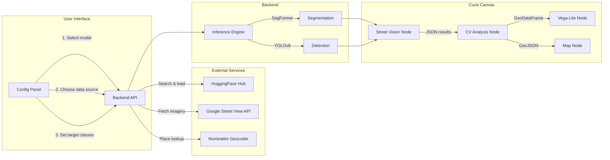

# Street-Level Vision Analytics Node for Curio

A configurable computer vision node for [Curio](https://github.com/urban-toolkit/curio), an urban visual analytics platform. This node enables urban planners and city analysts to apply pre-trained deep learning models — semantic segmentation and object detection — to street-level imagery fetched live from the Google Street View Static API, all through an interactive interface without writing code. Results flow as GeoJSON into Curio's dataflow graph for downstream map, chart, and table visualization.

**CS 524: Big Data Visual Analytics — Spring 2026 — Group 13**

**Team:** L. Sravya Rachakonda & Laxmi Sai Maneesh Reddy Jupalle

---

## Features

- **Model selection** — Browse and search HuggingFace models by task type (segmentation, detection) with live search and download counts
- **Real street imagery** — Google Street View Static API with place-name search (Nominatim-powered), bounding-box sampling, and coverage estimation
- **Real CV inference** — Actual SegFormer semantic segmentation on CPU with per-pixel class predictions and colored overlay generation
- **Local folder fallback** — Point the node at any folder of local images for offline analysis
- **Configurable target classes** — Select classes via suggestion chips (Cityscapes preset) or type custom classes, with CSV upload support
- **Results gallery** — Interactive image grid with color-coded metric badges (green/amber/red based on class ratios)
- **Image inspector** — Source photo, CV overlay (composited from real segmentation mask), side-by-side comparison, and per-class breakdown bar chart
- **Consistent color system** — Shared palette across overlays, charts, and chips (road=blue, building=green, vegetation=amber, sky=light blue, sidewalk=pink)
- **Compound filtering** — Filter results by any class attribute with configurable operators (e.g., "vegetation > 30%")
- **Error flagging** — Flag incorrect CV outputs for exclusion from aggregation
- **Two-node Curio integration** — Separate **Street Vision** (data acquisition + inference) and **CV Analysis** (results visualization) nodes so computation spans a dataflow graph rather than living in one monolithic node
- **GeoJSON + DataFrame export** — Results available as GeoJSON FeatureCollection *and* as column/row-oriented DataFrames for Vega-Lite / UTK consumption

---

## Architecture


```mermaid
flowchart LR
    subgraph User Interface
        A[Config Panel] -->|1. Select model| B[Backend API]
        A -->|2. Choose data source| B
        A -->|3. Set target classes| B
    end

    subgraph External Services
        HF[HuggingFace Hub]
        GSV[Google Street View API]
        NOM[Nominatim Geocoder]
    end

    subgraph Backend
        B -->|Search & load| HF
        B -->|Place lookup| NOM
        B -->|Fetch imagery| GSV
        B --> INF[Inference Engine]
        INF -->|SegFormer| SEG[Segmentation]
        INF -->|YOLOv8| DET[Detection]
    end

    subgraph Curio Canvas
        SEG --> SV[Street Vision Node]
        DET --> SV
        SV -->|JSON results| CV[CV Analysis Node]
        CV -->|GeoDataFrame| VEGA[Vega-Lite Node]
        CV -->|GeoJSON| MAP[Map Node]
    end
```

### Data Flow

1. **Configure** — User selects a CV model from HuggingFace, a location via place search (→ bbox), and target classes
2. **Fetch** — Backend geocodes the place, samples the bbox against the Street View Metadata API, and downloads images
3. **Infer** — Images are processed through the selected model (SegFormer or YOLOv8) on the backend
4. **Analyze** — Street Vision pushes structured JSON to the CV Analysis node, which renders the gallery, overlays, and per-class metrics
5. **Export** — CV Analysis emits a GeoDataFrame / GeoJSON for Curio's downstream Vega-Lite, UTK, and map nodes

---

## Tech Stack

| Layer | Technology |
|-------|-----------|
| Backend | Python, FastAPI, Uvicorn |
| CV Models | HuggingFace Transformers (SegFormer), Ultralytics YOLOv8 |
| Street Imagery | Google Street View Static API + Metadata API |
| Geocoding | OpenStreetMap Nominatim |
| Frontend | React 18, TypeScript, Vite, Tailwind CSS |
| Curio Integration | React Flow v11, custom BoxDescriptor + lifecycle hooks (2 nodes) |
| Spatial Processing | GeoPandas, Shapely |
| Data Formats | GeoJSON, JSON, CSV |

---

## Setup

### Prerequisites

- Python 3.10+
- Node.js 18+
- **Google Maps API key** with the Street View Static API and Street View Metadata API enabled — required
- (Optional) HuggingFace token — only needed for private models

### Backend

```bash
# Create and activate virtual environment (from repo root)
python -m venv .venv
source .venv/bin/activate        # macOS/Linux
# .venv\Scripts\activate         # Windows

# Install dependencies
pip install -r requirements.txt

# Configure environment
cp .env.example .env
# Edit .env to add GOOGLE_MAPS_API_KEY=...

# Start the server
uvicorn backend.main:app --reload --port 8000
```

API docs are available at `http://127.0.0.1:8000/docs`.

### Frontend

```bash
cd frontend
npm install
npm run dev
```

Open `http://localhost:5173` in your browser.

### Running with Curio (all 4 servers)

```bash
# Terminal 1 — Curio Flask backend (port 5002)
cd curio && python -c "from utk_curio.backend.app import create_app; app=create_app(); app.run(host='localhost', port=5002)"

# Terminal 2 — Street Vision backend (port 8000)
uvicorn backend.main:app --reload --port 8000

# Terminal 3 — Street Vision frontend (port 5173)
cd frontend && npm run dev

# Terminal 4 — Curio frontend (port 3000)
cd curio/utk_curio/frontend/urban-workflows && npx webpack serve --mode development --port 3000
```

Then open `http://localhost:3000`, drag **Street Vision** and **CV Analysis** from the node palette, connect them, and start analyzing.

> For detailed installation instructions, see [docs/setup.md](docs/setup.md).

---

## Project Structure

```
.
├── backend/                  # FastAPI server + CV inference pipeline
│   ├── main.py               #   App entry point, CORS middleware
│   ├── config.py             #   Environment settings (pydantic-settings)
│   ├── routers/              #   API endpoint modules (health, models, data, inference)
│   ├── services/             #   HuggingFace, Google Street View, inference, spatial, cache
│   ├── models/               #   Pydantic request/response schemas
│   └── utils/                #   Image processing and geo helpers
├── frontend/                 # React + TypeScript standalone UI (Vite)
│   └── src/
│       ├── components/       #     ConfigPanel (sidebar), Gallery (results), common UI
│       ├── hooks/            #     useModels, useInference, useDataSource, useFilters
│       ├── services/         #     Axios API client
│       ├── utils/            #     apiBase resolver (Vite + Curio/webpack compatible)
│       ├── constants/        #     Shared class color palette
│       └── types/            #     TypeScript interfaces
├── curio-integration/        # Files for Curio node registration
│   └── streetVisionLifecycle.tsx
├── curio/                    # Full Curio fork with Street Vision + CV Analysis nodes registered
├── data/                     # Class definitions and sample bboxes
│   ├── chicago_bbox.json
│   └── class_definitions/    #   Cityscapes 19-class CSV, street furniture CSV
├── evaluation/               # Case studies and task inventory
└── docs/                     # Documentation
```

---

## Dataset Access

### Google Maps API Key

This project uses the [Google Street View Static API](https://developers.google.com/maps/documentation/streetview). To enable image fetching:

1. Create a Google Cloud project
2. Enable the **Street View Static API** and **Street View Metadata API**
3. Create an API key and restrict it as needed
4. Add it to your `.env`:
   ```
   GOOGLE_MAPS_API_KEY=AIza...
   ```

The Metadata API is free — coverage checks and bbox sampling do not count against your image quota. Only full-image downloads consume it.

---

## Quick Demo

1. Start backend (`uvicorn backend.main:app --reload --port 8000`) and frontend (`cd frontend && npm run dev`)
2. Open `http://localhost:5173`
3. **Step 1** — Search `cityscapes`, select `segformer-b2-finetuned-cityscapes-1024-1024`
4. **Step 2** — Pick **Street View**, type `Lincoln Park Chicago`, hit Enter, choose a result, click **Check Coverage**
5. **Step 3** — Click chips: `vegetation`, `road`, `building`, `sidewalk`, `sky`
6. Click **Run Analysis** — real SegFormer inference runs on images fetched from Google Street View
7. Browse the gallery, click any card to open the inspector with real segmentation overlays
8. In Curio: drag **Street Vision** → **CV Analysis** → **Vega-Lite/Map** nodes, connect them, run — data flows downstream as GeoDataFrame / GeoJSON

---

## Case Studies

### Chicago Greenery Assessment
- **Model:** SegFormer (semantic segmentation, `nvidia/segformer-b2-finetuned-cityscapes-1024-1024`)
- **Data:** Google Street View images from Chicago neighborhoods
- **Classes:** vegetation, sidewalk, road, building, sky
- **Output:** Per-image greenery percentage, per-class breakdown, spatial aggregation

### Vehicle Counting
- **Model:** YOLOv8 (object detection)
- **Data:** Local camera folder or Google Street View
- **Classes:** car, truck, motorcycle, bicycle
- **Output:** Object counts per image, bounding box visualization

---

## Evaluation

Our evaluation focuses on **what new analytical tasks the node enables**, not CV model accuracy:

1. **Task inventory** — 7 specific analytical tasks newly enabled by the node (see `evaluation/task_inventory.md`)
2. **Case study walkthrough** — End-to-end Chicago greenery analysis with real SegFormer on Street View imagery
3. **Configuration generality** — Same node reconfigured for vehicle counting (model swap, no code changes)
4. **Multi-node dataflow** — Demonstrates Curio's value proposition by splitting data acquisition (Street Vision) from analysis/visualization (CV Analysis) across a dataflow graph

---

## API Reference

See [docs/api_reference.md](docs/api_reference.md) for complete endpoint documentation with request/response examples.

| Endpoint | Method | Description |
|----------|--------|-------------|
| `/api/health` | GET | Health check and API-key status |
| `/api/models/search` | GET | Search HuggingFace models by task |
| `/api/models/{id}/info` | GET | Get model metadata |
| `/api/models/load` | POST | Load model into memory |
| `/api/data/streetview/search_place` | GET | Geocode a place name → bbox |
| `/api/data/streetview/coverage` | POST | Estimate Street View coverage for a bbox |
| `/api/data/streetview/fetch` | POST | Fetch panorama metadata in a bbox |
| `/api/data/folder/load` | POST | Load images from local folder |
| `/api/inference/run` | POST | Start async inference job |
| `/api/inference/status/{id}` | GET | Poll job progress |
| `/api/inference/results/{id}` | GET | Get job results |
| `/api/inference/results/{id}/geojson` | GET | Export results as GeoJSON |
| `/api/inference/results/{id}/dataframe` | GET | Export results as column/row DataFrame |
| `/api/inference/results/{id}/curio_export` | GET | Save as Curio-native `.data` file |

---

## License

This project is developed for academic purposes as part of CS 524 at the University of Illinois Chicago.
